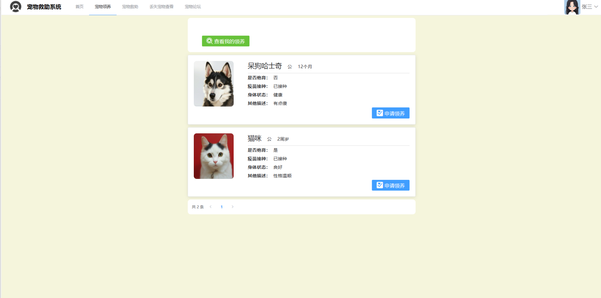

# 流浪动物救助管理系统

### 9.9￥ 获取完整源码+sql，附赠19000字论文参考，需要的加Q：3808981644 微信：qszard26
### 有问题，或者需要协助调试运行项目的也可联系
### 获取更多项目，关注公众号：编程项目集

## 一、介绍

基于springboot+vue的前后端分离流浪动物救助管理系统

开发语言：java

运行环境:idea或eclipse vscode 数据库:mysql

前端技术：Vue、ELementUI、echarts

后端技术：SpringBoot、Mybatis-Plus

系统角色：用户、管理员

1、用户的主要功能：

首页：展示公告列表，宠物科普，介绍流浪宠物，热门活动
注册、登录、宠物领养、宠物救助、丢失宠物查看、宠物论坛

2、管理员的主要功能：

用户管理、申请领养管理、评论管理、流浪动物救助、动物走失管理、救助站管理、帖子管理、捐赠管理、公告管理、科普文章管理、活动管理等

## 二、部分页面截图展示

## 三、19000字论文参考

### 9.9￥ 获取完整源码+sql，附赠19000字论文参考，需要的加Q：3808981644 微信：qszard26
### 有问题，或者需要协助调试运行项目的也可联系

